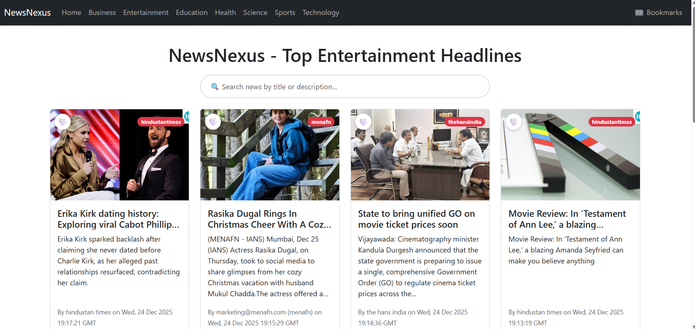
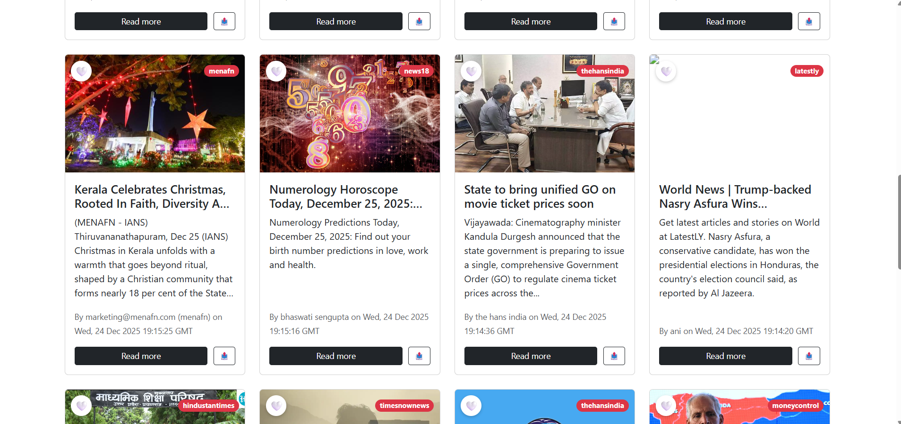
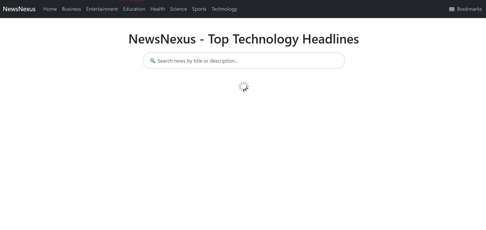
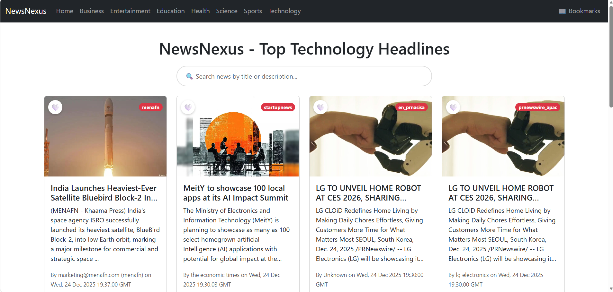
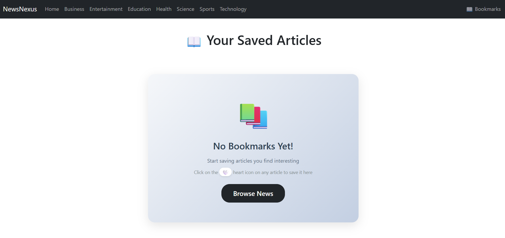
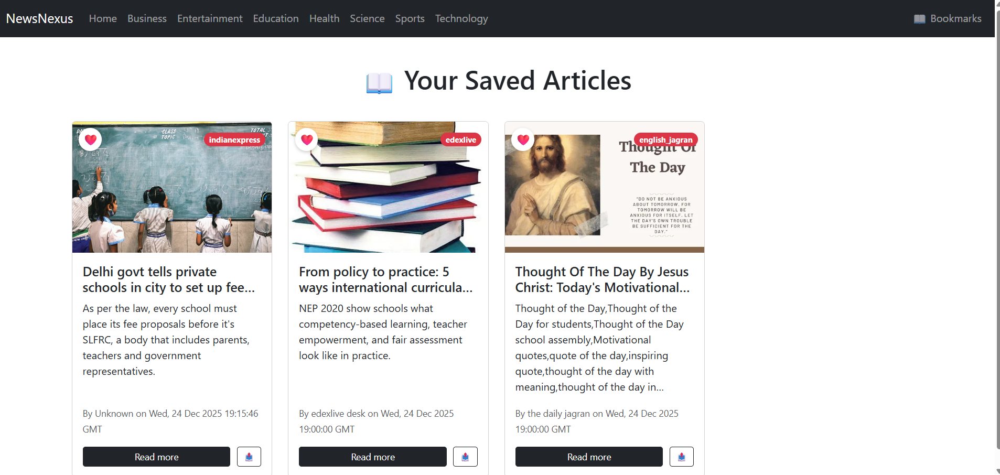
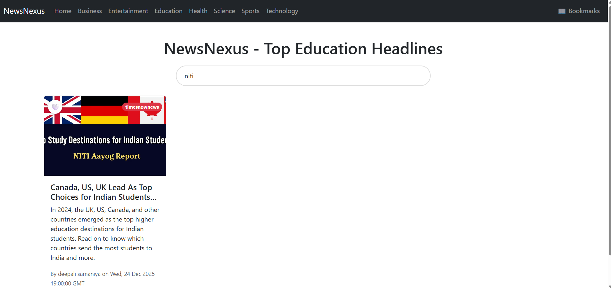
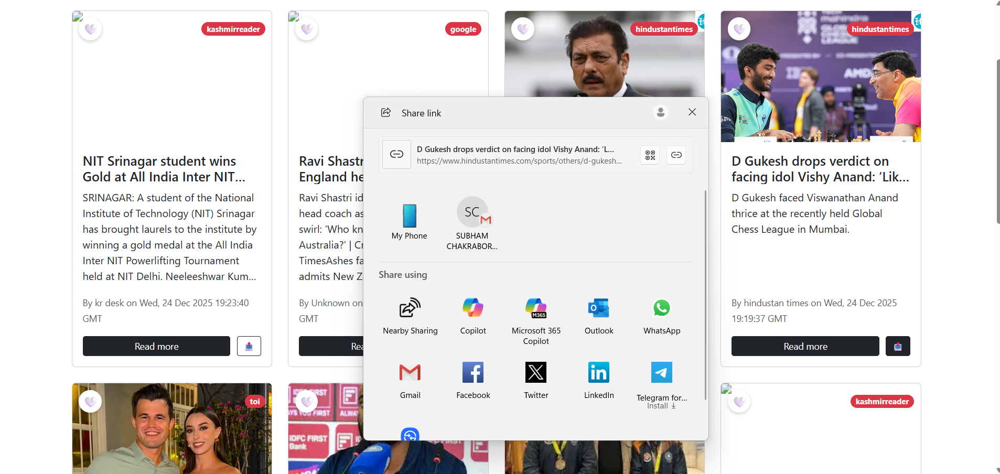

# NewsNexus – Real-Time News Aggregator

NewsNexus is a modern, responsive, category-based news aggregation platform that delivers real-time news updates from trusted global sources. Built with a focus on performance and user experience, it allows users to seamlessly browse the latest headlines across multiple categories using live data powered by NewsData.io API.

## Why NewsNexus?

In today’s fast-paced digital world, users need instant access to reliable news without information overload. NewsNexus addresses this by offering:
- Real-time updates from verified news sources
- Clean and distraction-free UI
- Category-wise filtering for faster content discovery
- Optimized performance with smooth navigation
- practical features like search and bookmarks to make staying updated effortless.

## Problem Statement

Most existing news platforms suffer from one or more of the following issues:
- Excessive advertisements and cluttered interfaces
- Articles often have irregular layouts, making scanning and reading tiring.
- Users cannot easily save interesting articles for later.
- Searching within a specific feed or category is often limited or missing.

##  Solution Statement

NewsNexus solves these issues by providing:
- A clean, Bootstrap‑based layout with equal‑height news cards and controlled description length for consistent UI.
- Category‑wise browsing (business, entertainment, education, health, science, sports, technology, etc.) using a modern React frontend.
- Built‑in search, bookmarks, and sharing to give users control over what they read and save.
- Infinite scrolling with loading indicators for a smooth, app‑like experience.

##  Key Features

- **Category‑based news**: Browse curated headlines by category (business, entertainment, education, health, science, sports, technology, and more).

- **Infinite scroll**: Seamless loading of more articles as you scroll, with progress indication.

- **Equal‑height cards**: All news cards have consistent height, with title and description clamped to fixed lines for a polished grid.

- **Search within results**: Search by title or description inside the current feed.

- **Bookmarks**: Save articles using a heart icon and view them later on a dedicated Bookmarks page.

- **Share support**: Share articles via the Web Share API (with clipboard fallback).

- **Responsive UI**: Fully responsive with Bootstrap 5 for desktop and mobile.

- **Loading indicators**: Global top progress bar and spinner components.

## Screenshots












## Project Structure
```
newsnexus/
├── public/                        # Static assets served directly
│   ├── index.html                 # Main HTML template for React entry
│   ├── icons8-news-48.png         # Favicon / app icon for NewsNexus
│   ├── manifest.json              # PWA manifest & metadata
│   └── assets/                    # Additional static images and assets
│
├── src/                           # Application source code (React)
│   ├── components/                # Reusable UI building blocks
│   │   ├── NavBar.jsx             # Top navigation bar and category links
│   │   ├── News.jsx               # Core news feed logic & infinite scroll
│   │   ├── NewsItem.jsx           # Individual news card (title, desc, actions)
│   │   ├── Spinner.jsx            # Loading spinner component
│   │   └── Bookmarks.jsx          # Saved articles / bookmarks page
│   │
│   ├── App.jsx                    # Root component, routes & layout wiring
│   ├── index.js                   # React entry point, DOM mounting
│   └── index.css                  # Global styles and overrides
│
├── package.json                   # Dependencies, scripts, and project metadata
└── README.md                      # Project documentation and usage guide

```

## Getting Started

### Prerequisites
- Node.js (LTS version recommended)

- npm

- A valid API key from NewsData.io (or similar news API)

### Project Setup

1. Clone the repository
```bash
https://github.com/Subham62/NewsNexus.git
```

2. Navigate to the project directory (if required)
```bash
cd newsnexus
```
3. Install dependencies
```bash
npm install
```

4. Configure environment
```
Create a .env file (or directly edit the URL in News.js) and set your API key.
```

5. Run the development server
```bash
npm start
```

## Technologies Used

- **Frontend Library**: React (class components)

- **Routing**: React Router

- **Styling & Layout**: Bootstrap 5 (CDN)

- **Infinite Scroll**: react-infinite-scroll-component

- **Icons & Badges**: Bootstrap utilities and emojis

- **API**: NewsData.io latest endpoint for fetching news

- **Storage**: localStorage for bookmarks

## Contribution Guidelines

Contributions are welcome! To contribute:

1. Fork the repository.

2. Create a new feature/bugfix branch:

```bash
git checkout -b feature/your-feature-name
```
3. Make your changes with clear, concise commits.

4. Ensure the app runs without errors and passes basic checks (npm start / npm run build).

5. Open a Pull Request with:

- A clear title

- A short description of what you changed

- Screenshots if the change affects the UI

Please follow consistent code style (use meaningful names, keep components focused, and avoid unnecessary duplication).

## Feedback and Issues

If you encounter any issues or have feedback, please open an issue on the *GitHub* repository. Your input helps improve Mentiv with every update.

⭐ If roadmap-driven learning makes sense to you, consider starring this repository.

## Acknowledgement

- Thanks to NewsData.io (or your chosen provider) for powering the news data.

- Bootstrap and React communities for excellent tooling and documentation.

- Inspiration from modern news and content platforms that focus on clean reading experiences.